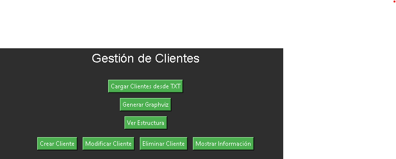
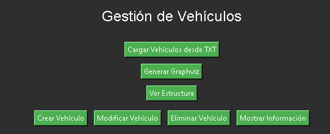
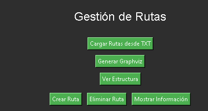
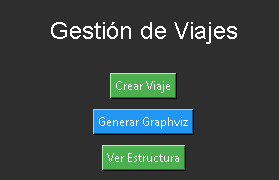

# Manual de Usuario

## Proyecto 2: "Llega Rapidito"

### Universidad de San Carlos de Guatemala  
Facultad de Ingeniería  
Escuela de Ciencias y Sistemas  

---

## Descripción del Sistema

"Llega Rapidito" es una aplicación diseñada para gestionar de forma eficiente la información de una empresa de transporte, permitiendo registrar, modificar, eliminar y consultar datos relacionados con clientes, vehículos, rutas y viajes. Además, genera reportes gráficos y tablas que facilitan la toma de decisiones.

---

## Requisitos Mínimos del Sistema

### Hardware
- **Procesador:** Intel Core i3 o superior.
- **RAM:** 4 GB o más.
- **Espacio en Disco:** 500 MB libres.

### Software
- **Sistema Operativo:** Windows 10, Linux, o macOS.
- **Python:** Versión 3.11 o superior.
- **Bibliotecas Requeridas:**
  - tkinter o PyQt (Interfaz gráfica).
  - Graphviz (Generación de gráficos).
  - Pandas (Análisis de datos).

### Instalación de Graphviz
1. Descargue e instale Graphviz desde su [sitio oficial](https://graphviz.org/download/).
2. Configure las variables de entorno para asegurar que el sistema reconozca la herramienta.

---

## Instalación de la Aplicación
1. Descargue el archivo comprimido `[EDD]Proyecto2_<carnet>.rar`.
2. Extraiga los archivos en un directorio de su elección.
3. Ejecute el archivo `app.py` desde un terminal o un entorno de desarrollo compatible.

---

## Funcionalidades del Sistema

### Gestión de Clientes
- **Descripción:** Permite registrar, modificar, eliminar y consultar información de clientes.
- **Datos Requeridos:**
  - DPI (Número único obligatorio).
  - Nombre, Apellidos, Género, Teléfono y Dirección.
- **Opciones del Menú:**
  1. **Agregar Cliente:** Introduzca los datos solicitados en el formulario.
  2. **Modificar Cliente:** Ingrese el DPI para localizar al cliente y modifique sus datos.
  3. **Eliminar Cliente:** Proporcione el DPI del cliente a eliminar.
  4. **Mostrar Información:** Busque un cliente específico ingresando su DPI.
  5. **Visualizar Estructura:** Genera un gráfico de la lista circular doblemente enlazada.

### Gestión de Vehículos
- **Descripción:** Administra vehículos en un árbol B de orden 5.
- **Datos Requeridos:**
  - Placa, Marca, Modelo y Precio por Segundo.
- **Opciones del Menú:**
  1. **Agregar Vehículo:** Registre los datos del vehículo.
  2. **Modificar Vehículo:** Introduzca la placa para modificar sus datos.
  3. **Eliminar Vehículo:** Ingrese la placa del vehículo a eliminar.
  4. **Mostrar Información:** Consulte los detalles ingresando la placa.
  5. **Visualizar Estructura:** Genera un gráfico del árbol B.

### Gestión de Rutas
- **Descripción:** Representa las rutas disponibles mediante un grafo de listas de adyacencia.
- **Datos Requeridos:**
  - Origen, Destino y Tiempo de Ruta.
- **Opciones del Menú:**
  1. **Cargar Rutas:** Al iniciar la aplicación, cargue el archivo `rutas.txt`.
  2. **Visualizar Rutas:** Consulte el grafo generado con Graphviz.
  

### Gestión de Viajes
- **Descripción:** Almacena detalles de los viajes realizados en una lista simplemente enlazada.
- **Datos Requeridos:**
  - ID, Lugar de Origen, Lugar de Destino, Fecha y Hora, Cliente, Vehículo y Ruta Tomada.
- **Opciones del Menú:**
  1. **Crear Viaje:** Seleccione cliente, vehículo y ruta para crear el viaje.
  2. **Visualizar Rutas del Viaje:** Grafique la lista con los detalles del recorrido.
    

### Generación de Reportes
- **Descripción:** Proporciona estadísticas clave en tablas y gráficos.
- **Reportes Disponibles:**
  1. **Top Viajes:** Muestra los 5 viajes con más destinos.
  2. **Top Ganancia:** Lista los 5 viajes más caros.
  3. **Top Clientes:** Identifica los 5 clientes con más viajes.
  4. **Top Vehículos:** Muestra los 5 vehículos más utilizados.
  5. **Ruta de un Viaje:** Grafica la ruta de un viaje específico.

---

## Uso de la Aplicación

### Inicio
1. Ejecute el archivo `app.py`.
2. Cargue el archivo de rutas solicitado al inicio.

### Navegación
- Utilice el menú principal para seleccionar la entidad que desea gestionar (Clientes, Vehículos, Rutas o Viajes).
- Siga las instrucciones en pantalla para realizar las operaciones correspondientes.

### Recomendaciones
- Asegúrese de cargar los archivos de datos en el formato correcto antes de iniciar.
- Genere reportes regularmente para analizar el desempeño.

---

## Resolución de Problemas

### Errores Comunes
1. **Error al Cargar Archivos:** Verifique que los archivos de datos sigan el formato requerido.
2. **Problemas con Graphviz:** Confirme que está instalado correctamente y configurado en las variables de entorno.

### Soporte
Si encuentra un error no documentado, comuníquese con el equipo de desarrollo a través del correo soporte@llegarapidito.com.

---

## Créditos
- **Catedrático:** Ing. Edgar Ornelis
- **Tutor Académico:** Elian Estrada

---

Gracias por utilizar "Llega Rapidito". ¡Esperamos que facilite su gestión empresarial!
